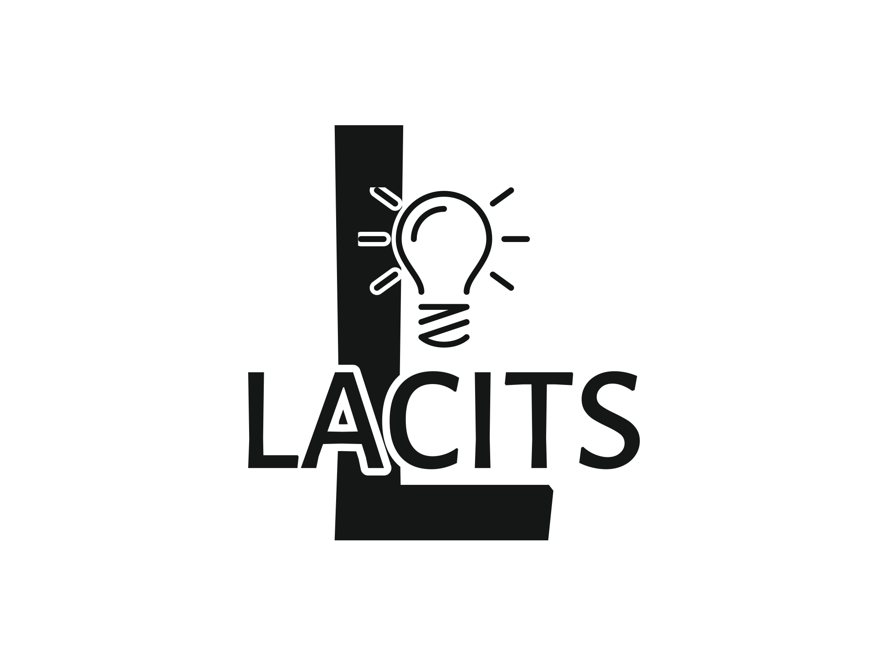

<p align="center">
  
</p>


# Quanser Balance Package

## Introduction
This is a framework that is designed to simulate the dynamics of and train a model to control the Quanser Qube-Servo3 inverted rotary pendulum.

## TODO
- [ ] Model dynamics.
- [ ] Train RL model.
- [ ] Deploy demo to real-world.

## Simulation and Dynamics

## Installation

```bash
conda create -n quanser_env python=3.10
conda activate quanser_env
git clone https://github.com/al-oman/quanser-balance.git
cd quanser-balance
pip install -e .
```